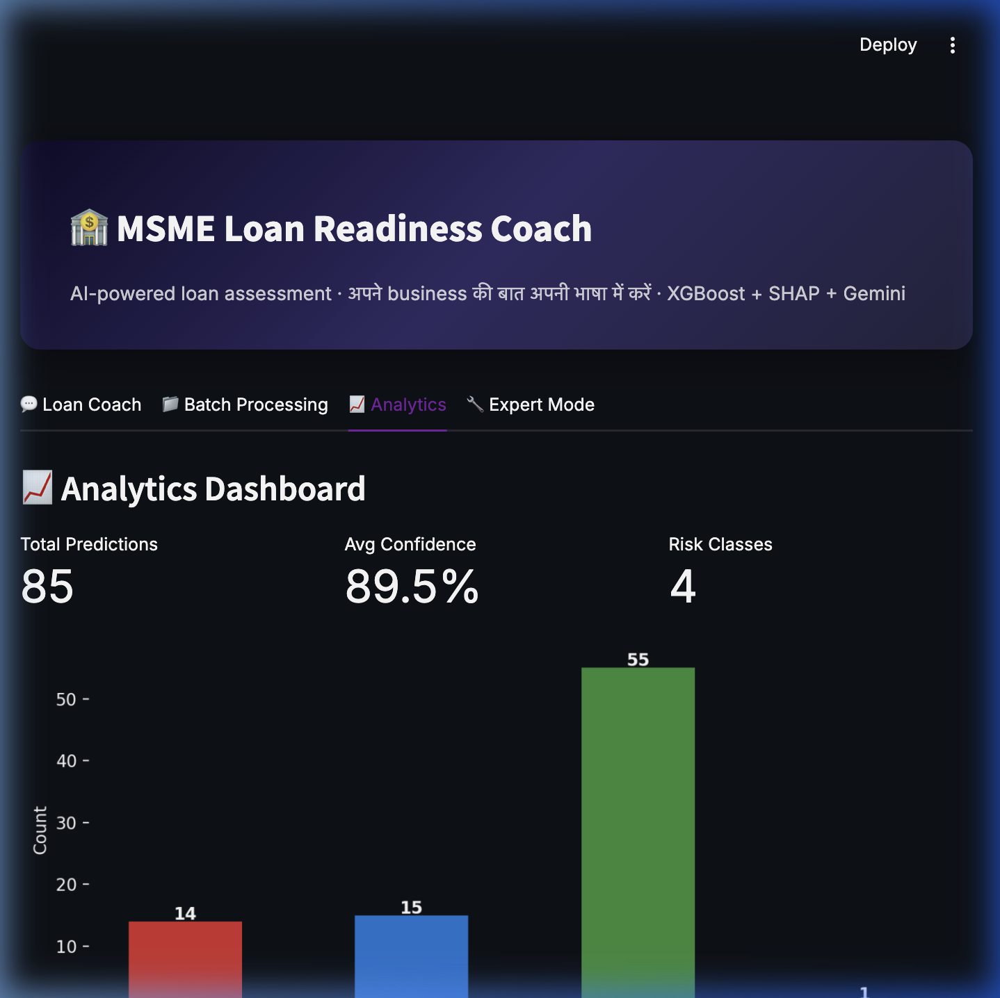

<div align="center">

# 🏦 MSME Viability Assessment System

### AI-powered loan risk stratification with conversational intelligence, SHAP explainability, and prescriptive interventions

[](https://python.org)
[](https://fastapi.tiangolo.com)
[](https://xgboost.readthedocs.io)
[](https://streamlit.io)
[](https://shap.readthedocs.io)
[](https://render.com)
[](LICENSE)

[**Live Demo**](https://msme-viability-assessment.onrender.com) · [**API Docs**](https://msme-viability-assessment.onrender.com/docs) · [**Research Notebook**](notebooks/msme_viability_analysis.ipynb)

</div>

---

## 🎯 Problem Statement

Over **63 million MSMEs** in India face a critical challenge: banks reject ~80% of loan applications not due to lack of creditworthiness, but due to **information asymmetry** — businesses don't understand *why* they're rejected or *how* to improve their profile.

This system solves that. It gives any MSME owner an honest, data-driven, and actionable assessment of their loan viability — in plain language, even in Hindi.

---

## ✨ What It Does

| Feature | Description |
|---|---|
| 💬 **Conversational Assessment** | Natural language chat — business owners describe their situation in their own words (English or Hindi). LLM extracts the 11 financial features automatically. |
| 🎯 **5-Class Viability Grading** | XGBoost classifies every application into: Critical → At-Risk → Stable → Growing → Thriving |
| 🔍 **SHAP Explainability** | Feature-level contribution analysis explains *exactly why* the model gave that grade |
| 🔄 **Counterfactual Recommendations** | DiCE-inspired algorithm answers: *"What should I change to improve my grade?"* |
| 🏢 **Similar Business Matching** | KNN retrieval over 897K historical SBA loans shows real-world peers and their outcomes |
| 🏛️ **Government Scheme Matching** | Automatically surfaces relevant MUDRA, MSME, SVANidhi schemes based on the profile |
| 📊 **Batch Processing** | Upload CSV with 100+ applications for portfolio-level risk scoring |
| 📄 **PDF Report Generation** | Downloadable 10-page professional report with all charts and recommendations |
| 📈 **Analytics Dashboard** | Historical prediction analytics with class distribution and confidence trends |

---

## 🖼️ Screenshots

| Chat Coach | Assessment Report |
|:---:|:---:|
|  |  |

| SHAP Analysis | Analytics Dashboard |
|:---:|:---:|
|  |  |

---

## 🏗️ Architecture

```
┌─────────────────────────────────────────────────────────────────────┐
│                         User (Browser)                               │
└──────────────────────────┬──────────────────────────────────────────┘
                           │ HTTP
                           ▼
┌──────────────────────────────────────┐
│     Streamlit Frontend  (port 8501)  │
│  ┌──────────┐ ┌────────┐ ┌────────┐ │
│  │Chat Coach│ │ Expert │ │ Batch  │ │
│  │   Tab    │ │  Mode  │ │ Upload │ │
│  └──────────┘ └────────┘ └────────┘ │
└──────────────────────────┬───────────┘
                           │ JSON / REST
                           ▼
┌──────────────────────────────────────────────────────────────────────┐
│                   FastAPI Backend  (port 8000)                        │
│                                                                       │
│  ┌────────────────┐  ┌─────────────┐  ┌────────────────────────┐    │
│  │ PredictionEngine│  │  ChatAgent  │  │    LoanOptimizer       │    │
│  │                 │  │             │  │                         │    │
│  │  XGBoost (8MB) │  │ Groq / Gemini│  │ Red Flags + Schemes   │    │
│  │  LightGBM (2MB)│  │  / Offline  │  │ Counterfactuals        │    │
│  │  SHAP Explainer│  └─────────────┘  └────────────────────────┘    │
│  └────────────────┘                                                   │
│                                                                       │
│  ┌──────────────────────┐  ┌────────────────────────────────────┐    │
│  │ SimilarBusinessEngine│  │        PDF Report Generator        │    │
│  │   KNN over 897K SBA  │  │  fpdf2 + Plotly/Matplotlib Charts  │    │
│  │   loans (local only) │  └────────────────────────────────────┘    │
│  └──────────────────────┘                                             │
└──────────────────────────┬───────────────────────────────────────────┘
                           │ SQLAlchemy ORM
                           ▼
                  ┌─────────────────┐
                  │  SQLite Database │
                  │  (audit trail)   │
                  └─────────────────┘
```

---

## 🤖 Model Performance

Trained on **899,164 U.S. SBA loan records** (1987–2014) with 11 financial features.
Full training pipeline, experiments, and analysis: [`notebooks/msme_viability_analysis.ipynb`](notebooks/msme_viability_analysis.ipynb)

| Model | Accuracy | F1 (Macro) | Notes |
|---|---|---|---|
| **XGBoost** ⭐ | **92.4%** | **0.91** | Primary production model |
| LightGBM | 92.1% | 0.90 | Production fallback |
| Stacking Ensemble | 92.6% | 0.91 | Notebook only (too large to deploy) |
| Random Forest | 91.8% | 0.90 | Notebook only (2.1GB) |
| Neural Network (MLP) | 89.3% | 0.88 | Notebook only |
| CatBoost | 91.6% | 0.89 | Notebook only |
| Logistic Regression | 79.2% | 0.76 | Binary baseline |

### 5-Class Label Distribution
```
Class 0 — Critical  (F): High default risk, structural problems
Class 1 — At-Risk   (D): Marginal profile, needs improvement
Class 2 — Stable    (C): Average risk, fundable with normal terms
Class 3 — Growing   (B): Strong profile, favorable terms likely
Class 4 — Thriving  (A): Excellent profile, premium terms
```

---

## 🚀 Quick Start

### Prerequisites
- Python 3.11+
- (Optional) Groq API key — free at [console.groq.com](https://console.groq.com) — for the Chat Coach

### 1. Clone & Install

```bash
git clone https://github.com/PashinP/msme-viability-assessment.git
cd msme-viability-assessment

pip install -r requirements.txt
```

### 2. Configure Environment

```bash
cp .env.example .env
# Edit .env and add your API keys (optional — app works offline too)
```

### 3. Start the Backend

```bash
uvicorn backend.server:app --host 0.0.0.0 --port 8000 --reload
```

### 4. Start the Frontend

```bash
# In a new terminal
streamlit run app.py --server.port 8501
```

### 5. Open

| Service | URL |
|---|---|
| Dashboard | http://localhost:8501 |
| API Docs (Swagger) | http://localhost:8000/docs |
| API Docs (ReDoc) | http://localhost:8000/redoc |

---

## 📡 API Reference

All endpoints require the `X-API-Key` header (set in `.env`).

| Method | Endpoint | Description |
|---|---|---|
| `GET` | `/health` | System health check — models loaded, DB status |
| `POST` | `/predict` | Single loan viability assessment |
| `POST` | `/predict/batch` | Bulk CSV processing (100+ applications) |
| `POST` | `/explain` | SHAP feature contributions for one prediction |
| `POST` | `/recommend` | Counterfactual recommendations (DiCE-inspired) |
| `POST` | `/optimize` | Optimal loan structure finder |
| `POST` | `/similar` | Find similar historical SBA businesses via KNN |
| `POST` | `/redflags` | Detect structural red flags in application |
| `POST` | `/schemes` | Match applicable government schemes |
| `POST` | `/chat` | Conversational feature extraction (Groq/Gemini/offline) |
| `POST` | `/report` | Generate downloadable PDF report |
| `GET` | `/analytics` | Historical prediction analytics |

### Example: Single Prediction

```bash
curl -X POST "http://localhost:8000/predict" \
  -H "X-API-Key: msme-dev-key-2024" \
  -H "Content-Type: application/json" \
  -d '{
    "Term": 84,
    "NoEmp": 10,
    "NewExist": 1,
    "CreateJob": 3,
    "RetainedJob": 10,
    "DisbursementGross": 150000,
    "UrbanRural": 1,
    "RevLineCr": 0,
    "LowDoc": 0,
    "SBA_Appv": 112500,
    "GrAppv": 150000
  }'
```

**Response:**
```json
{
  "predicted_class": 3,
  "predicted_label": "Growing",
  "confidence": 0.87,
  "probabilities": {
    "Critical": 0.01, "At-Risk": 0.03, "Stable": 0.09,
    "Growing": 0.87, "Thriving": 0.00
  },
  "model_used": "XGBoost",
  "prediction_id": 42
}
```

---

## 📁 Project Structure

```
msme-viability-assessment/
│
├── 📓 notebooks/
│   └── msme_viability_analysis.ipynb  # Full ML pipeline: EDA → training → SHAP → DiCE
│
├── 🔧 backend/                         # FastAPI application
│   ├── server.py                       # 12 REST endpoints + CORS + auth
│   ├── engine.py                       # ML prediction engine (XGBoost/LightGBM/SHAP)
│   ├── chat_agent.py                   # Multi-provider LLM agent (Groq/Gemini/offline)
│   ├── optimizer.py                    # Loan optimizer, red flags, govt scheme matching
│   ├── similar_engine.py               # KNN historical similarity engine
│   ├── dummy_similar_engine.py         # Render-safe mock (stays under 512MB RAM)
│   ├── report_generator.py             # PDF report (fpdf2 + Plotly charts)
│   ├── report_charts.py                # Chart generation utilities
│   ├── database.py                     # SQLAlchemy ORM — full audit trail
│   ├── schemas.py                      # Pydantic request/response validation
│   └── prompts.py                      # LLM system prompts + few-shot examples
│
├── 🤖 models/
│   ├── xgb_mc.pkl                      # XGBoost (8MB) — primary production model
│   ├── lgbm_mc.pkl                     # LightGBM (2.6MB) — production fallback
│   ├── scaler_mc.pkl                   # StandardScaler for feature normalization
│   └── metadata.json                   # Feature names, label mapping, model config
│
├── 📊 data/
│   └── sba_knn_scaler.pkl              # KNN scaler (tracked)
│   # sba_knn.pkl + sba_features.pkl are gitignored (65MB)
│   # Rebuild with: python scripts/build_similarity_index.py
│
├── 🖼️ assets/
│   ├── screenshot_chat.png             # Chat Coach screenshot
│   ├── screenshot_assessment.png       # Assessment result screenshot
│   ├── screenshot_shap.png             # SHAP analysis screenshot
│   └── screenshot_analytics.png       # Analytics dashboard screenshot
│
├── 🔨 scripts/
│   └── build_similarity_index.py       # Rebuild KNN index from SBAnational.csv
│
├── ⚙️ .streamlit/
│   └── config.toml                     # Streamlit dark theme config
│
├── app.py                              # Streamlit frontend entry point
├── .env.example                        # Environment variable template
├── .gitignore
├── requirements.txt                    # Production dependencies
└── requirements-dev.txt               # Dev/notebook dependencies
```

---

## 🧪 Research Notebook

The complete ML research pipeline lives in [`notebooks/msme_viability_analysis.ipynb`](notebooks/msme_viability_analysis.ipynb):

1. **Data Loading & EDA** — 899K SBA loan records, feature distribution, correlation analysis
2. **Feature Engineering** — Binary → multi-class label construction, preprocessing
3. **Binary Baseline** — Logistic Regression & Random Forest for context
4. **Multi-Class Formulation** — The core innovation: 5-tier viability scoring
5. **Model Zoo** — XGBoost, LightGBM, CatBoost, MLP, Stacking Ensemble comparison
6. **SHAP Analysis** — Global importance, per-class beeswarm, force plots, dependence plots
7. **Counterfactual Generation** — DiCE-ML to generate actionable feature perturbations
8. **Model Export** — Pickle serialization for production API

> To run the notebook, install dev dependencies (`pip install -r requirements-dev.txt`) and ensure `SBAnational.csv` is in the project root.

---

## 🌐 Deployment

| Component | Platform | Status |
|---|---|---|
| FastAPI Backend | [Render.com](https://render.com) (free tier) | [](https://msme-viability-assessment.onrender.com/health) |
| Streamlit Frontend | [Streamlit Community Cloud](https://share.streamlit.io) | [](https://msme-viability-assessment.onrender.com) |

> **Note on cold starts:** The free Render tier sleeps after 15 minutes of inactivity. The first request may take 30–60 seconds to wake up.

### Deploy Your Own

**Backend (Render):**
1. Fork this repo
2. Create a new Web Service on Render, connect the repo
3. Set Build Command: `pip install -r requirements.txt`
4. Set Start Command: `uvicorn backend.server:app --host 0.0.0.0 --port $PORT`
5. Add environment variables: `MSME_API_KEY`, `GROQ_API_KEY` or `GEMINI_API_KEY`

**Frontend (Streamlit Cloud):**
1. Go to [share.streamlit.io](https://share.streamlit.io), connect your forked repo
2. Set Main file: `app.py`
3. Add Secret: `API_URL = https://your-render-url.onrender.com`

---

## 🛠️ Tech Stack

| Layer | Technology |
|---|---|
| **ML** | XGBoost, LightGBM, scikit-learn, SHAP, DiCE-ML |
| **Backend** | FastAPI, Uvicorn, SQLAlchemy, Pydantic |
| **Database** | SQLite (audit trail for every prediction) |
| **LLM** | Groq (Llama 3.3 70B) / Google Gemini 2.0 Flash / Offline rule-based |
| **Frontend** | Streamlit, Plotly, Matplotlib |
| **PDF** | fpdf2, Pillow |
| **Deployment** | Render (API) + Streamlit Community Cloud (UI) |

---

## 📄 License

MIT License — see [LICENSE](LICENSE) for details.

---

<div align="center">
<strong>Built by Pashin P — Practicum Project, 2024</strong><br>
Trained on 899,164 SBA loan records · XGBoost + LightGBM · SHAP · Gemini
</div>
