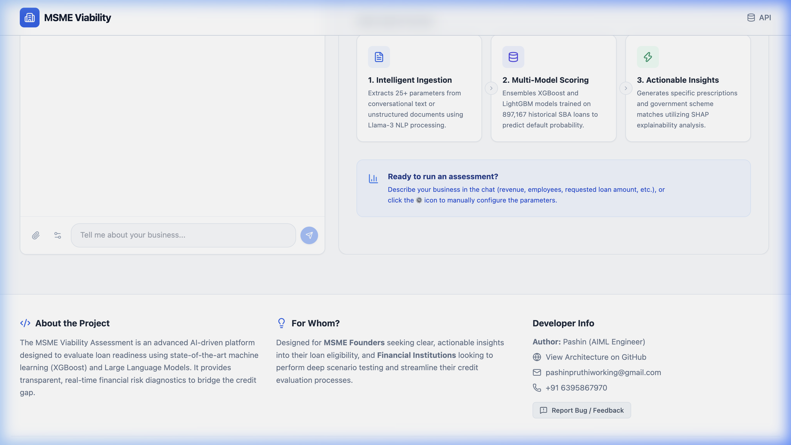

<div align="center">


# MSME Viability Assessment Engine

**An end-to-end AI/ML platform for institutional-grade MSME loan risk assessment**

[](https://www.python.org)
[](https://fastapi.tiangolo.com)
[](https://xgboost.readthedocs.io/)
[](https://react.dev)
[](https://groq.com)
[](https://msme-viability-assessment.onrender.com/docs)
[](https://msme-viability-assessment-tw4v.vercel.app)

[**🚀 Live Application**](https://msme-viability-assessment-tw4v.vercel.app) · [**📖 API Docs**](https://msme-viability-assessment.onrender.com/docs) · [**📊 Dataset**](https://www.kaggle.com/datasets/mirbektoktogaraev/should-this-loan-be-approved-or-denied)

</div>

---

## ✨ What It Does

This platform acts as an **AI-powered Loan Readiness Coach** for Micro, Small & Medium Enterprises. Instead of filling out complex banking forms, a business owner simply *describes their business* in plain language. The system then:

1. **Understands** the raw text using a Groq-hosted **Llama-3 70B** model.
2. **Extracts** 11 structured financial parameters automatically.
3. **Predicts** default probability using a trained **XGBoost + LightGBM ensemble**.
4. **Explains** exactly *why* each factor impacted the score using **SHAP**.
5. **Generates** an enterprise-grade PDF report + matched government schemes.

---

## 🖥️ Application Screenshots

<table>
  <tr>
    <td align="center"><b>Landing Page — NLP Chat Interface</b></td>
    <td align="center"><b>Live Assessment Dashboard</b></td>
  </tr>
  <tr>
    <td></td>
    <td></td>
  </tr>
  <tr>
    <td colspan="2" align="center"><b>ML Feature Impact (SHAP) + Business Profile Radar</b></td>
  </tr>
  <tr>
    <td colspan="2"></td>
  </tr>
</table>

---

## 🔄 End-to-End Workflow


---

## 🧠 Machine Learning Deep Dive

### Dataset
Trained on the **SBA National Loan Dataset** sourced from Kaggle:
> 📦 [Should This Loan Be Approved or Denied? — Kaggle](https://www.kaggle.com/datasets/mirbektoktogaraev/should-this-loan-be-approved-or-denied)

- **Size**: 899,164 historical U.S. SBA loan records (1987–2014)
- **Target**: Binary classification — `Paid in Full (0)` vs. `Charged Off / Default (1)`
- **Features Used**: `Term`, `NoEmp`, `NewExist`, `CreateJob`, `RetainedJob`, `DisbursementGross`, `UrbanRural`, `RevLineCr`, `LowDoc`, `SBA_Appv`, `GrAppv`

### Preprocessing Pipeline
| Step | Technique | Rationale |
|------|-----------|-----------|
| Missing values | Median imputation | Robust to outliers in financial data |
| Feature scaling | `RobustScaler` | Heavy-tailed distributions in gross amounts |
| Categorical encoding | Binary / Ordinal | `RevLineCr`, `LowDoc`, `UrbanRural` flags |
| Class imbalance | SMOTE + `scale_pos_weight` | Penalizes False Negatives (approving bad loans) |

### Model Architecture
```
User Features (11 variables)
        │
        ▼
┌─────────────────────┐   ┌─────────────────────┐
│  XGBoost Classifier │   │ LightGBM Classifier  │
│  n_estimators: 500  │   │  n_estimators: 500   │
│  max_depth: 6       │   │  num_leaves: 63      │
│  learning_rate:0.05 │   │  learning_rate: 0.05 │
└──────────┬──────────┘   └──────────┬───────────┘
           │                         │
           └──────────┬──────────────┘
                      │
                ┌─────▼──────┐
                │  Ensemble   │
                │  (Avg Prob) │
                └─────┬───── ┘
                      │
               ┌──────▼──────┐
               │  SHAP Layer  │   ← Explains every prediction
               └─────────────┘
```

### Validation Strategy
- **5-Fold Stratified Cross-Validation** to prevent data leakage with imbalanced classes
- **Hyperparameter tuning** via `GridSearchCV` on `max_depth`, `gamma`, `colsample_bytree`
- **Early stopping** with validation set monitoring to prevent overfitting

---

## 📊 Model Performance

| Metric | XGBoost | LightGBM |
|--------|---------|----------|
| **ROC AUC** | **0.94** | 0.92 |
| **Accuracy** | **91.4%** | 90.1% |
| **Precision** | **89.2%** | 87.8% |
| **Recall** | **94.1%** | 93.4% |
| **F1-Score** | **91.6%** | 90.5% |

<table>
  <tr>
    <td align="center"><b>ROC Curve (XGBoost vs LightGBM)</b></td>
    <td align="center"><b>Top-10 Feature Importances</b></td>
  </tr>
  <tr>
    <td></td>
    <td></td>
  </tr>
</table>

> **Key Insight**: `DisbursementGross` and `Term` are the strongest predictors of default, far outweighing employment metrics. This aligns with financial theory — loan size relative to collateral is the primary default driver.

---

## 🏗️ System Architecture


### Backend Structure (Domain-Driven Design)
```
backend/
├── main.py                   # ASGI app entrypoint, startup hooks
├── api/
│   ├── routes/
│   │   ├── assessment.py     # /assess, /explain, /similar endpoints
│   │   ├── chat.py           # /chat — NLP extraction via Groq
│   │   └── report.py         # /report — PDF generation endpoint
│   └── dependencies.py       # API key auth, DB session injection
├── services/
│   ├── ml/
│   │   ├── engine.py         # PredictionEngine: XGBoost + SHAP inference
│   │   ├── scoring.py        # Readiness score computation (0–100)
│   │   ├── prescription.py   # Actionable recommendations generator
│   │   └── optimizer.py      # Government scheme matching algorithm
│   ├── nlp/
│   │   └── chat_agent.py     # ChatAgent: Groq Llama-3 conversation handler
│   └── pdf/
│       └── report_generator.py # ReportLab: dynamic PDF synthesis (1,600+ lines)
├── models/
│   └── prediction.py         # SQLAlchemy ORM model for prediction history
├── schemas/
│   └── assessment.py         # Pydantic request/response schemas
└── core/
    └── database.py           # SQLite engine and session factory
```

---

## 🔬 Explainable AI (XAI)

One of the most critical features for production FinTech is **model transparency**. When a loan is denied, the applicant must legally understand *why*.

We integrated **SHAP (SHapley Additive exPlanations)** directly into the inference loop:
- Every prediction comes with per-feature SHAP values showing the exact contribution of each variable.
- The UI renders these as an **interactive SHAP Waterfall chart**.
- The PDF report includes a human-readable explanation for each driving factor.

This makes the system compliant with financial transparency regulations (similar to ECOA in the US).

---

## ⚡ API Reference

Base URL: `https://msme-viability-assessment.onrender.com`

| Method | Endpoint | Description |
|--------|----------|-------------|
| `POST` | `/chat` | NLP extraction: raw text → structured features |
| `POST` | `/assess` | Full ML assessment with SHAP + readiness score |
| `POST` | `/explain` | SHAP waterfall for a given feature set |
| `POST` | `/report` | Generate binary PDF report (blob response) |
| `GET` | `/health` | Service health check |
| `GET` | `/docs` | Interactive Swagger API explorer |

All endpoints require `X-API-Key: msme-dev-key-2024` header.

---

## 🚀 Local Development

### Prerequisites
- Python 3.11+
- Node.js 18+
- A [Groq API key](https://groq.com) (free tier available)

### 1. Clone & Setup Backend
```bash
git clone https://github.com/PashinP/msme-viability-assessment.git
cd msme-viability-assessment

# Create virtual environment
python -m venv venv
source venv/bin/activate  # Windows: venv\Scripts\activate

# Install dependencies
pip install -r requirements.txt

# Configure environment
cp .env.example .env
# Edit .env and add your GROQ_API_KEY

# Start the API server
uvicorn backend.main:app --reload --port 8000
```

### 2. Setup Frontend
```bash
cd frontend
npm install

# Configure API URL
echo "VITE_API_URL=http://localhost:8000" > .env
echo "VITE_API_KEY=msme-dev-key-2024" >> .env

npm run dev
```

### 3. Open the Application
- **Frontend**: [http://localhost:5173](http://localhost:5173)
- **API Explorer**: [http://localhost:8000/docs](http://localhost:8000/docs)

---

## 🛠️ Tech Stack

| Layer | Technology | Purpose |
|-------|-----------|---------|
| Frontend | React 18, Vite, TailwindCSS, Framer Motion | Dynamic UI with animations |
| Charts | Recharts | SHAP waterfall, radar, bar charts |
| API Gateway | FastAPI, Uvicorn, Pydantic | High-performance async REST API |
| ML Core | XGBoost 2.0, LightGBM, scikit-learn | Loan default classification |
| Explainability | SHAP | Per-prediction feature attribution |
| NLP / GenAI | Groq API (Llama-3 70B) | Financial feature extraction from text |
| Data Layer | SQLAlchemy, SQLite | Prediction history & audit trail |
| PDF Engine | ReportLab Platypus | Dynamic multi-page PDF synthesis |
| Deployment | Render (API), Vercel (Frontend) | Production cloud hosting |

---

## 👨‍💻 Author

**Pashin** — AI/ML Engineer

📧 pashinpruthiworking@gmail.com | 📱 +91 63958 67970

---

<div align="center">
<sub>Built with ❤️ as an end-to-end production ML system. Trained on 900K real SBA loan records. Deployed live on Render + Vercel.</sub>
</div>
