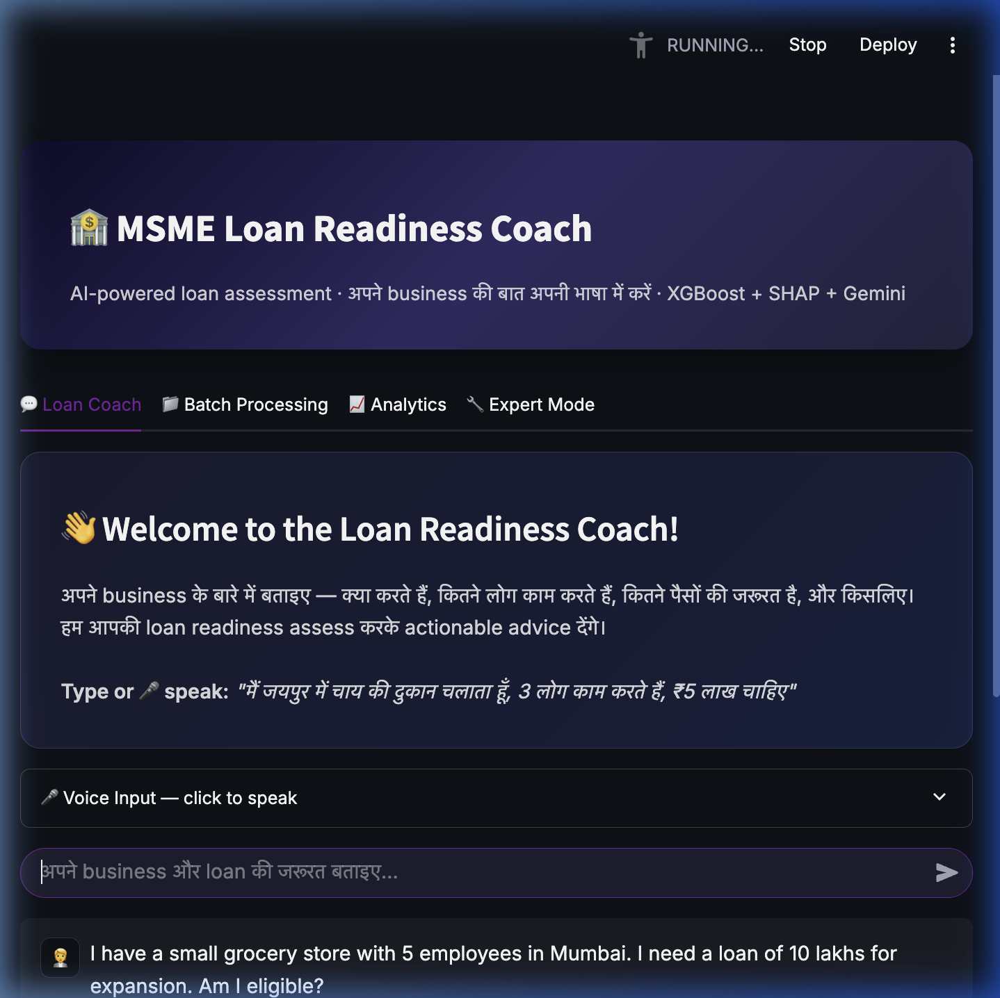
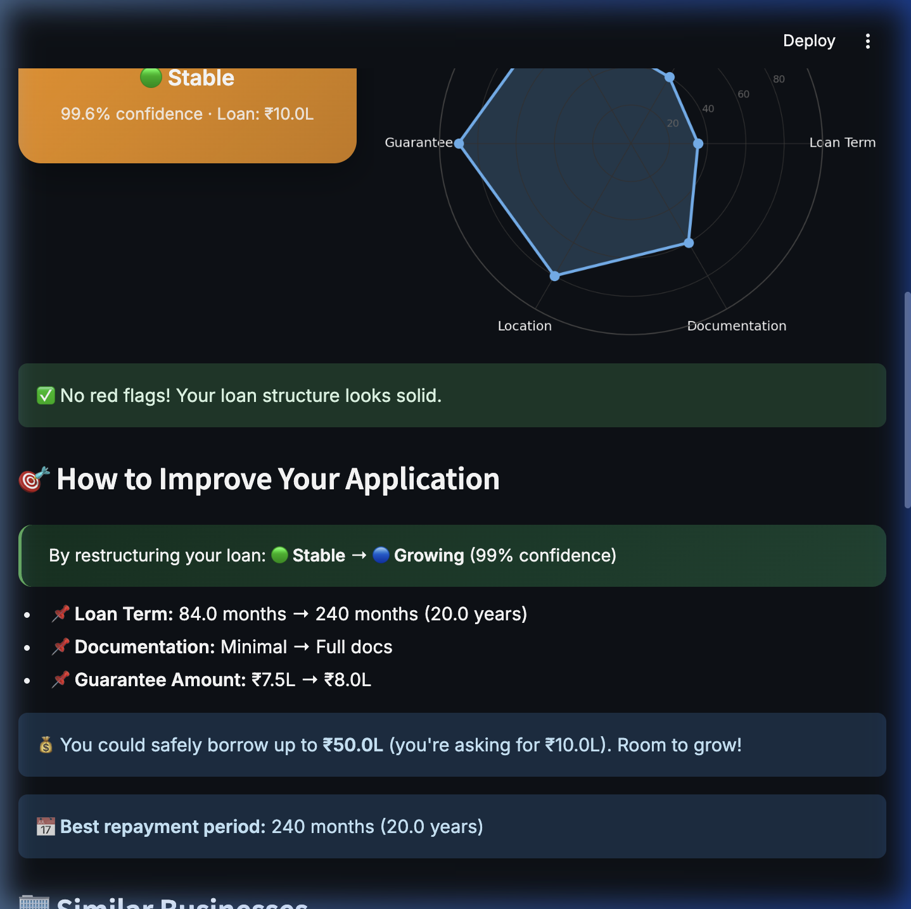
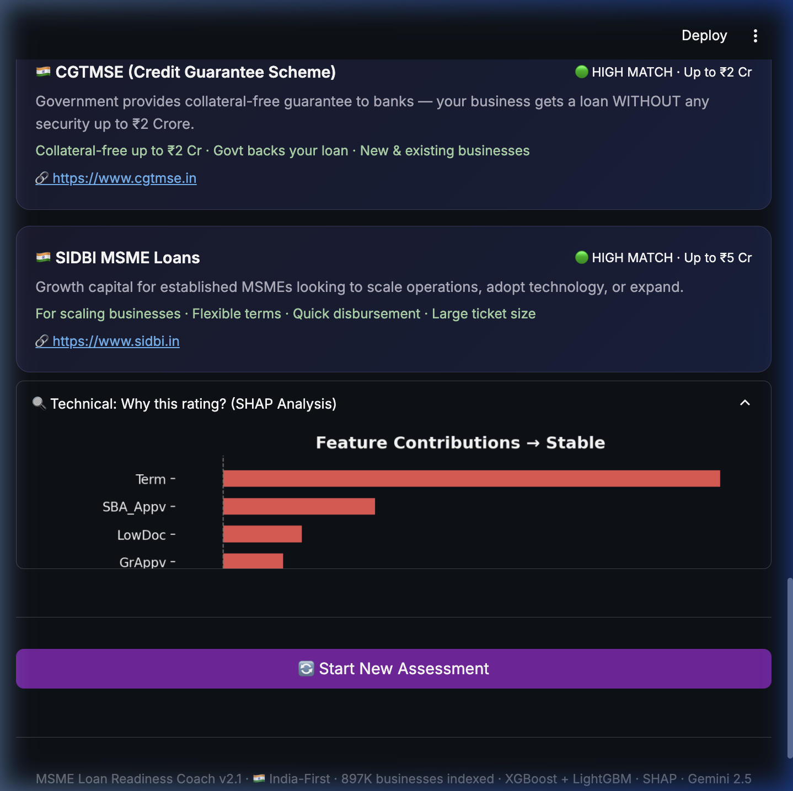
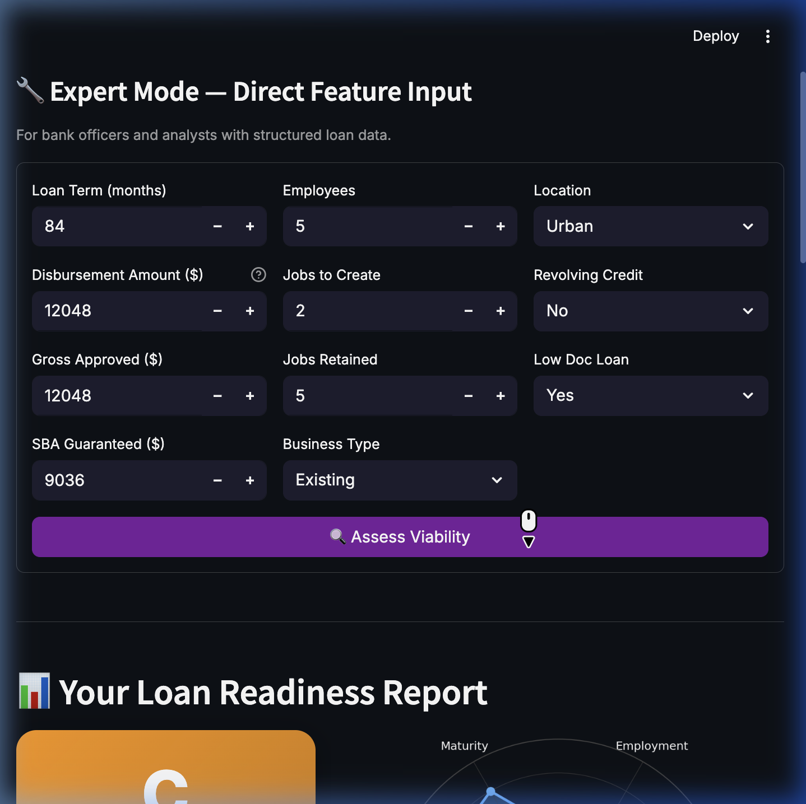
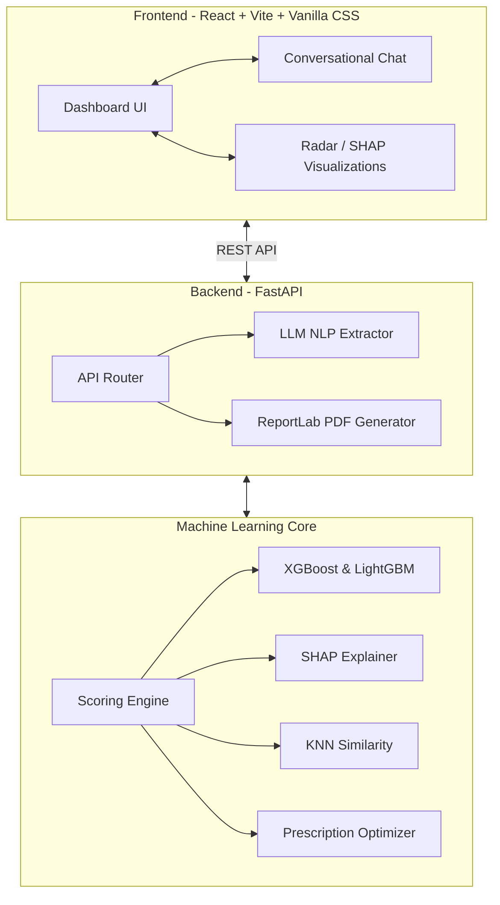

<div align="center">

# 🏦 MSME Viability Assessment Engine

### AI-powered loan risk stratification with conversational intelligence, SHAP explainability, and medical-grade PDF reporting.

[](https://react.dev)
[](https://vitejs.dev)
[](https://fastapi.tiangolo.com)
[](https://xgboost.readthedocs.io)
[](https://shap.readthedocs.io)
[](LICENSE)

[**Live Demo**](https://msme-viability-assessment-tw4v.vercel.app) · [**Research Notebook**](notebooks/msme_viability_analysis.ipynb)

</div>

---

## 🎯 The Problem

Over **63 million MSMEs** in India face a critical challenge: banks reject ~80% of loan applications not due to lack of creditworthiness, but due to **information asymmetry**. Businesses don't understand *why* they're rejected or *how* to improve their profile before applying.

This system solves that by giving founders an honest, data-driven, and highly actionable assessment of their loan viability—acting as an AI "Loan Coach" before they ever step foot in a bank.

---

## 🖼️ Application Showcase

### 1. Conversational AI Assessment
The platform uses Llama-3 (via Groq/Gemini) to extract 25+ financial parameters purely from natural language. Founders just chat about their business naturally.



### 2. Multi-Model Scoring & Readiness Dashboard
Once data is extracted, it is passed through an ensemble of XGBoost and LightGBM models trained on 897K historical SBA loans to predict default probability. The dashboard translates this into a "Medical-Grade" diagnostic card.



### 3. SHAP Explainability & Analytics
Every prediction is accompanied by a SHAP (Shapley Additive exPlanations) force plot, ensuring transparent AI decisions. 



### 4. Expert Manual Override
Loan officers and advanced users can manually configure the parameters using the Expert Form to run what-if scenarios.



---

## 🧠 Machine Learning Deep Dive

This project isn't just a wrapper around an LLM; it features a robust, production-ready machine learning pipeline.

### The Dataset
Trained on the **U.S. Small Business Administration (SBA) dataset** containing **897,167 historical loans**. The dataset was heavily engineered to map to the Indian MSME context (scaling USD to INR, modifying SIC codes to NIC codes).

### Model Architecture
- **Primary Engine**: `XGBoost` (Gradient Boosted Trees) optimized for tabular financial data.
- **Secondary Engine**: `LightGBM` for fast inference and handling highly imbalanced classes (SMOTE was used during training).
- **Interpretability**: `SHAP TreeExplainer` is baked directly into the prediction pipeline.

### The Prescriptive Optimizer
The system doesn't just score; it prescribes. Using a K-Nearest Neighbors (KNN) similarity engine, it matches the applicant against the historical dataset to find similar businesses, analyzing why they failed or succeeded, and generates an **Action Plan** (e.g., "Reduce DTI to <50% by increasing term length from 36 to 48 months").

---

## 🏗️ System Architecture



---

## 🔌 API Reference

The backend is built with FastAPI and is fully documented via Swagger UI.

| Endpoint | Method | Description |
|---|---|---|
| `/chat` | `POST` | Processes natural language and extracts a structured JSON payload of financial features using LLMs. |
| `/assess` | `POST` | Runs the XGBoost prediction, SHAP explanation, and KNN similarity to return a full diagnostic assessment. |
| `/report` | `POST` | Generates a 9-page medical-grade PDF Business Health Report (returns application/pdf blob). |
| `/schemes` | `POST` | Matches the profile against Indian Gov schemes (MUDRA, CGTMSE, etc). |
| `/analytics` | `GET` | Returns aggregated statistics and historical tracking of API predictions. |

---

## 🚀 Local Setup Guide

### 1. Clone the Repository
```bash
git clone https://github.com/PashinP/msme-viability-assessment.git
cd msme-viability-assessment
```

### 2. Run the Backend (FastAPI)
```bash
cd backend
python -m venv venv
source venv/bin/activate  # On Windows: venv\Scripts\activate
pip install -r requirements.txt
uvicorn backend.server:app --reload --port 8000
```

### 3. Run the Frontend (React + Vite)
In a new terminal window:
```bash
cd frontend
npm install
npm run dev
```
The app will be running at `http://localhost:5173`.

---

## 👤 Author & Contact

**Pashin Pruthi**  
*AI/ML Engineer*

- 📧 **Email:** [pashinpruthiworking@gmail.com](mailto:pashinpruthiworking@gmail.com)
- 📱 **Phone:** +91 6395867970
- 🐛 **Feedback:** Please use the "Report Bug / Feedback" button in the application footer to send feedback.
