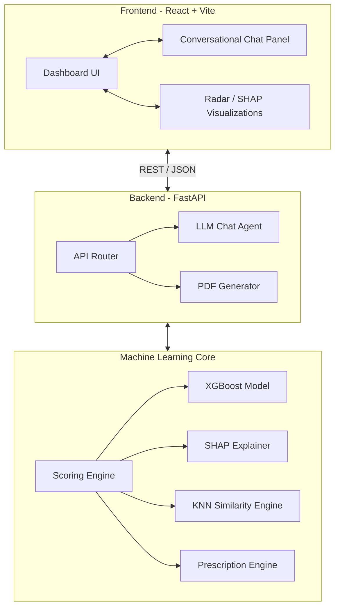

<div align="center">

# 🏦 MSME Viability Assessment System

### AI-powered loan risk stratification with conversational intelligence, SHAP explainability, and medical-grade PDF reporting.

[](https://react.dev)
[](https://vitejs.dev)
[](https://fastapi.tiangolo.com)
[](https://xgboost.readthedocs.io)
[](https://shap.readthedocs.io)
[](LICENSE)

[**Live Demo (Coming Soon)**](#) · [**API Docs (Coming Soon)**](#) · [**Research Notebook**](notebooks/msme_viability_analysis.ipynb)

</div>

---

## 🎯 The Problem

Over **63 million MSMEs** in India face a critical challenge: banks reject ~80% of loan applications not due to lack of creditworthiness, but due to **information asymmetry**. Businesses don't understand *why* they're rejected or *how* to improve their profile before applying.

This system solves that by giving founders an honest, data-driven, and highly actionable assessment of their loan viability—acting as an AI "Loan Coach" before they ever step foot in a bank.

---

## ✨ Key Features

| Feature | Description |
|---|---|
| 💬 **Conversational Assessment** | Natural language chat—founders describe their situation in their own words. LLM (Llama 3.3) extracts financial features automatically. |
| 🎯 **Diagnostic Scoring Engine** | XGBoost classifies applications and breaks down exactly *where* the application is weak (Repayment Capacity, Stability, etc). |
| 🔍 **SHAP Explainability** | Feature-level contribution analysis explains *exactly why* the model gave that grade, building trust with the user. |
| 📝 **Actionable Prescriptions** | Generates numbered, prioritized action plans (e.g., "Reduce DTI to <50% by increasing term length"). |
| 📄 **Business Health Report** | Downloads a highly professional 9-page PDF report with visual gauges, financial deep dives, and a pre-filled Draft Loan Application to take to the bank. |
| 🏛️ **Government Scheme Matching** | Automatically surfaces relevant CGTMSE, MUDRA, and SVANidhi schemes based on the profile. |

---

## 🏗️ System Architecture



---

## 🚀 Quickstart Guide

### 1. Clone & Install
```bash
git clone https://github.com/PashinP/msme-viability-assessment.git
cd msme-viability-assessment
```

### 2. Run the Backend (FastAPI)
```bash
cd backend
python -m venv venv
source venv/bin/activate  # On Windows: venv\Scripts\activate
pip install -r requirements.txt
python -m uvicorn server:app --reload --port 8000
```

### 3. Run the Frontend (React + Vite)
In a new terminal window:
```bash
cd frontend
npm install
npm run dev
```
Navigate to `http://localhost:5173` in your browser.

---

## 📄 License
This project is licensed under the MIT License - see the [LICENSE](LICENSE) file for details.
