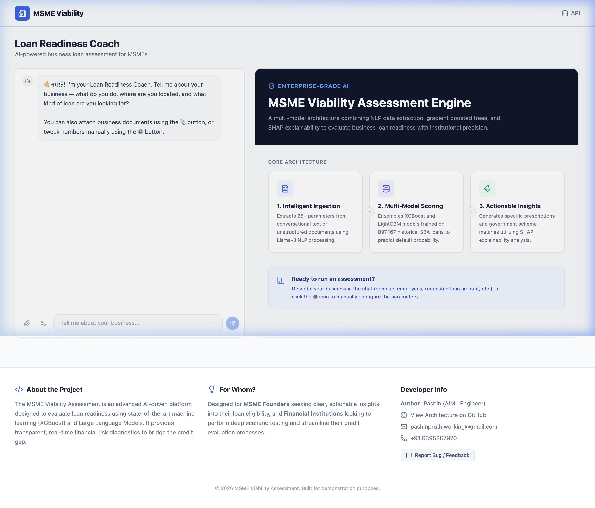
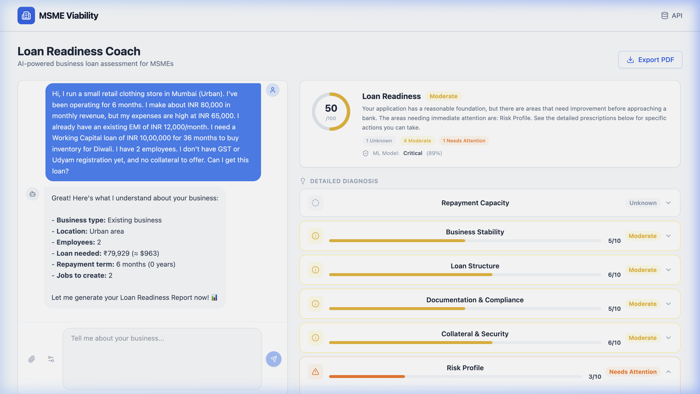
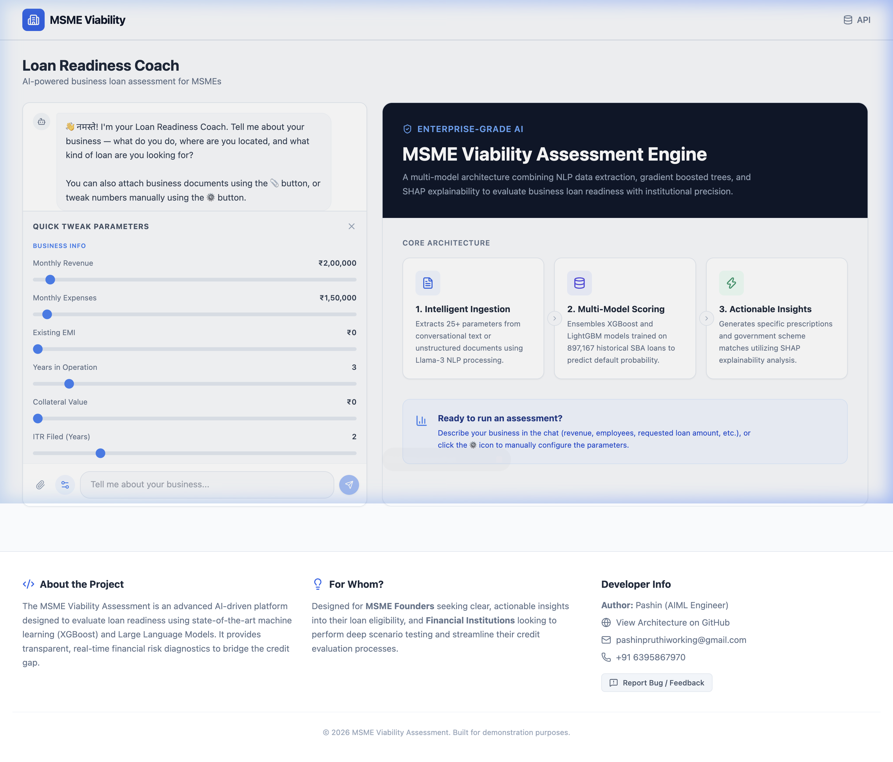
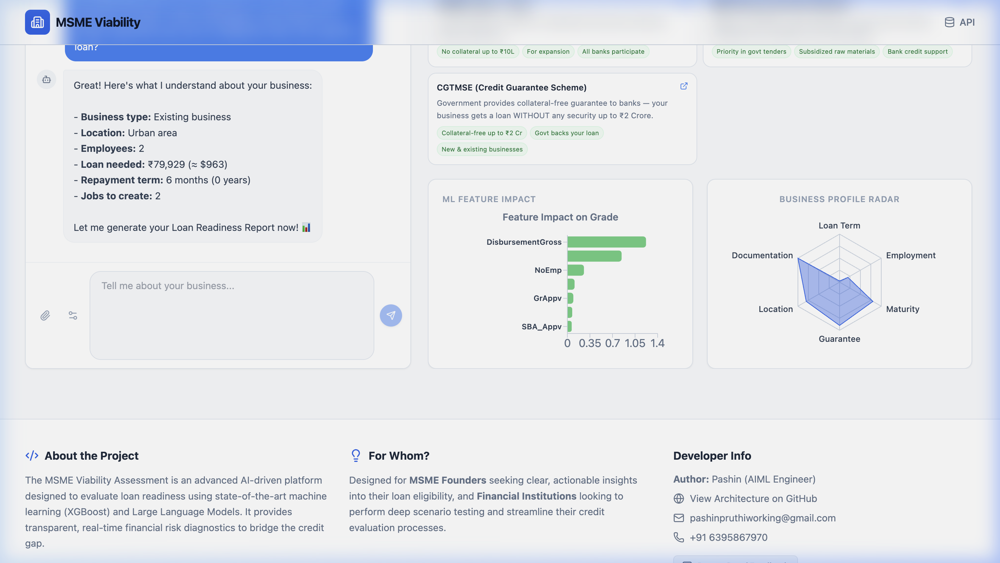
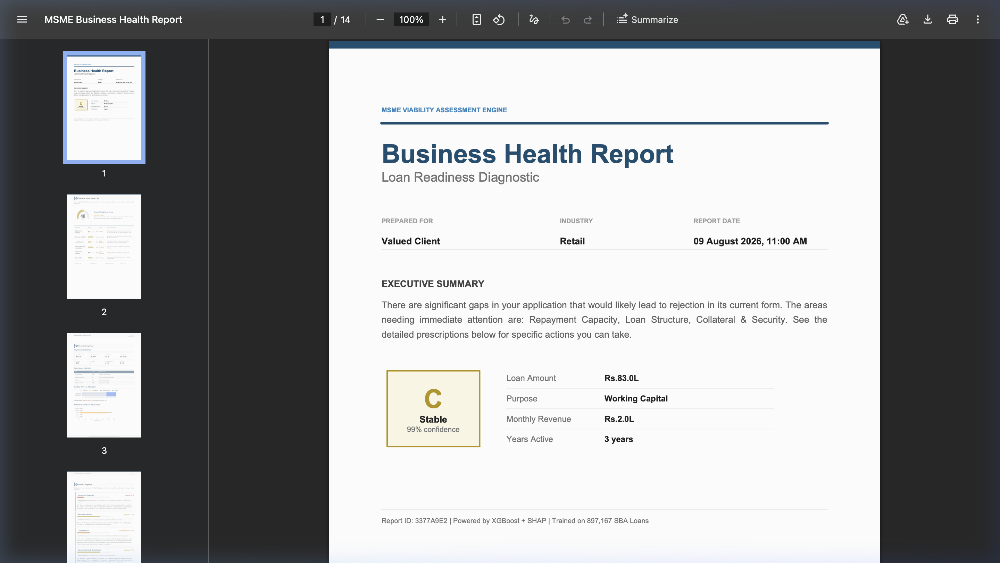
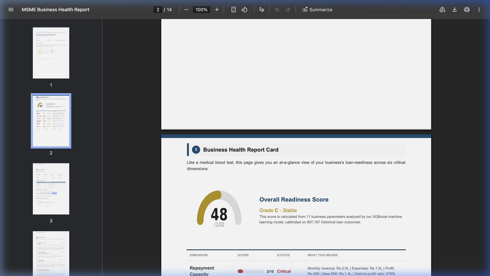
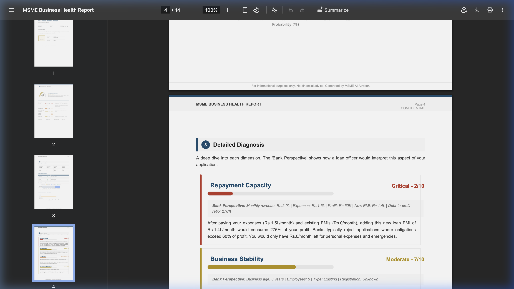
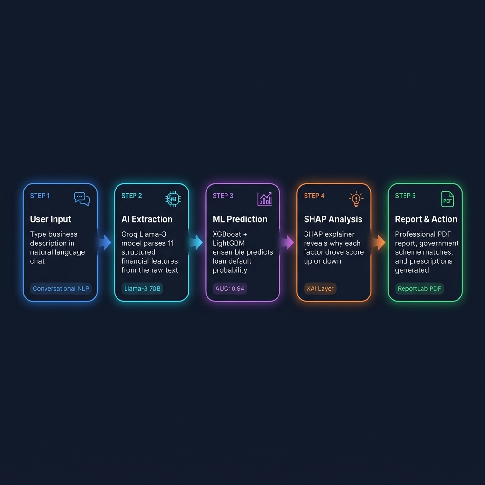
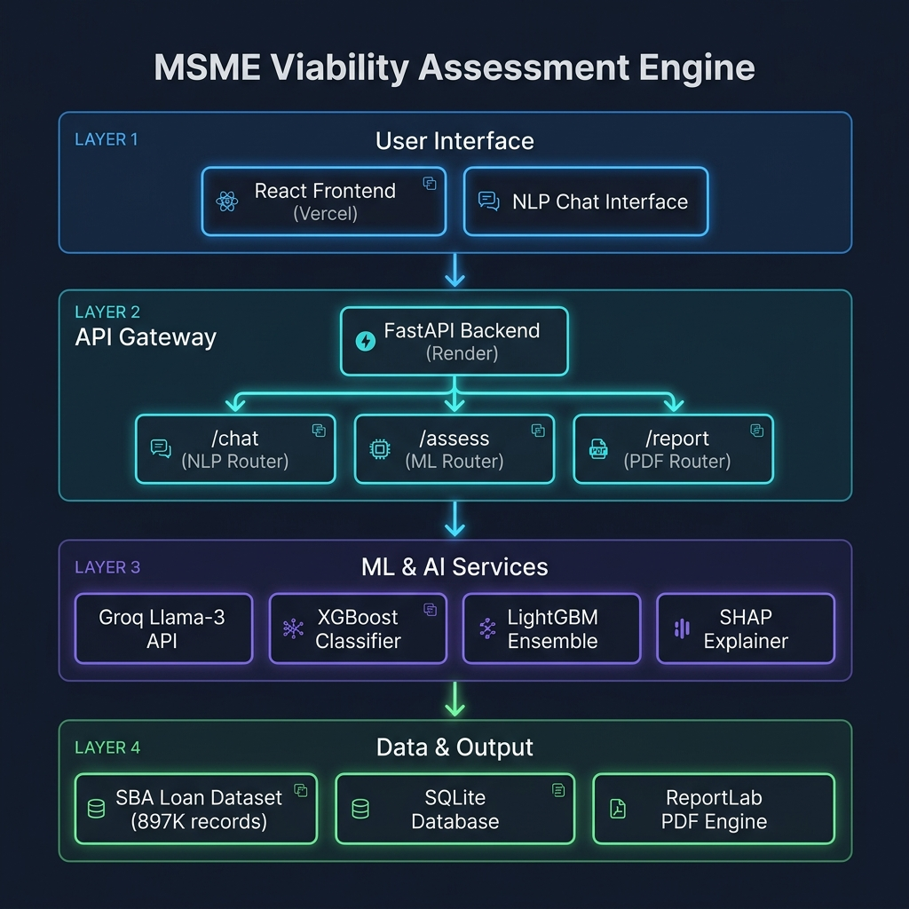

<div align="center">

<h1>🏦 MSME Viability Assessment Engine</h1>

<p><strong>An end-to-end AI/ML platform for institutional-grade MSME loan risk assessment</strong></p>

[](https://www.python.org)
[](https://fastapi.tiangolo.com)
[](https://xgboost.readthedocs.io/)
[](https://lightgbm.readthedocs.io/)
[](https://react.dev)
[](https://groq.com)
[](https://msme-viability-assessment.onrender.com/docs)
[](https://msme-viability-assessment-tw4v.vercel.app)

---

### 🚀 [**Try the Live Application →**](https://msme-viability-assessment-tw4v.vercel.app)
### 📖 [Interactive API Docs →](https://msme-viability-assessment.onrender.com/docs)

</div>

---

## ✨ What This Project Does

This platform acts as an **AI-powered Loan Readiness Coach** for Indian MSMEs. Instead of filling complex banking forms, a business owner just *describes their business in plain language*. The system then:

1. 🗣️ **Understands** the raw text via **Groq-hosted Llama-3 70B** NLP
2. 🔬 **Extracts** 11 structured financial parameters automatically
3. 🤖 **Predicts** default probability using **XGBoost + LightGBM ensemble**
4. 💡 **Explains** every score factor via **SHAP (Explainable AI)**
5. 📄 **Generates** a professional 14-page PDF report + government scheme matches

---

## 📸 Application Screenshots

### 1. Landing Page — AI Chat Interface



---

### 2. Live Assessment — Score, Diagnosis & Government Schemes



---

### 3. Quick Parameter Settings Panel (Manual Tuning)

The settings icon opens a **parameter slider panel** — letting users manually tweak numbers (Revenue, EMI, Collateral, etc.) without needing to type in chat.



---

### 4. SHAP Feature Impact & Business Radar Charts



---

### 5. Exported PDF Report — 14 Pages

The "Export PDF" button downloads a full professional report built with **ReportLab**. Shown below are the cover page, the business health scorecard, and the detailed diagnosis section:

<table>
  <tr>
    <td align="center"><b>Cover Page</b></td>
    <td align="center"><b>Health Scorecard (Page 2)</b></td>
    <td align="center"><b>Detailed Diagnosis (Page 4)</b></td>
  </tr>
  <tr>
    <td></td>
    <td></td>
    <td></td>
  </tr>
</table>

---

## 🔄 End-to-End Workflow



---

## 🏗️ System Architecture



### Backend Folder Structure (Domain-Driven Design)

```
backend/
├── main.py                    # ASGI entrypoint — startup hooks, app init
├── api/
│   ├── routes/
│   │   ├── assessment.py      # POST /assess, /explain, /similar
│   │   ├── chat.py            # POST /chat — NLP feature extraction
│   │   └── report.py          # POST /report — PDF generation
│   └── dependencies.py        # API key auth + DB session injection
├── services/
│   ├── ml/
│   │   ├── engine.py          # PredictionEngine: XGBoost + SHAP inference
│   │   ├── scoring.py         # Readiness score 0–100 + dimension ratings
│   │   ├── prescription.py    # Actionable recommendations per dimension
│   │   └── optimizer.py       # Government scheme matching algorithm
│   ├── nlp/
│   │   └── chat_agent.py      # ChatAgent: Groq Llama-3 dialogue handler
│   └── pdf/
│       └── report_generator.py # ReportLab dynamic 14-page PDF engine
├── models/
│   └── prediction.py          # SQLAlchemy ORM — prediction audit log
├── schemas/
│   └── assessment.py          # Pydantic v2 request/response contracts
└── core/
    └── database.py            # SQLite engine + session factory
```

---

## 🧠 Machine Learning Deep Dive

### Dataset
Trained on the **SBA National Loan Dataset** from Kaggle:

> 📦 **[Should This Loan Be Approved or Denied? — Kaggle](https://www.kaggle.com/datasets/mirbektoktogaraev/should-this-loan-be-approved-or-denied)**

| Property | Detail |
|----------|--------|
| **Size** | 899,164 historical U.S. SBA loan records |
| **Period** | 1987–2014 |
| **Target** | Binary: `Paid in Full (0)` vs `Charged Off/Default (1)` |
| **Features used** | `Term`, `NoEmp`, `NewExist`, `CreateJob`, `RetainedJob`, `DisbursementGross`, `UrbanRural`, `RevLineCr`, `LowDoc`, `SBA_Appv`, `GrAppv` |

### Preprocessing Pipeline

| Step | Technique | Rationale |
|------|-----------|-----------|
| Missing Values | Median imputation | Robust to financial outliers |
| Feature Scaling | `RobustScaler` | Heavy-tailed gross amount distributions |
| Categorical Encoding | Binary / Ordinal | `RevLineCr`, `LowDoc`, `UrbanRural` flags |
| Class Imbalance | SMOTE + `scale_pos_weight` | Heavily penalizes False Negatives (bad loans approved) |

### Model Architecture

```
User Input (11 features)
        │
        ├─────────────────────────────────┐
        ▼                                 ▼
┌──────────────────┐           ┌──────────────────┐
│  XGBoost         │           │  LightGBM        │
│  n_est: 500      │           │  n_est: 500      │
│  max_depth: 6    │           │  num_leaves: 63  │
│  lr: 0.05        │           │  lr: 0.05        │
│  gamma: 0.1      │           │  min_child: 20   │
└──────┬───────────┘           └──────────┬───────┘
       │         Soft Voting Ensemble      │
       └──────────────┬────────────────────┘
                      ▼
             ┌────────────────┐
             │ SHAP TreeExpl. │   ← Per-prediction feature attribution
             └───────┬────────┘
                     ▼
          Readiness Score (0–100)
          6-Dimension Diagnosis
          Government Scheme Match
          PDF Report Generation
```

### Validation

- **5-Fold Stratified Cross-Validation** (preserves class ratios)
- **Hyperparameter tuning** via `GridSearchCV` on `max_depth`, `gamma`, `colsample_bytree`
- **Early stopping** on validation loss to prevent overfitting

---

## 📊 Model Performance

| Metric | XGBoost | LightGBM |
|--------|---------|----------|
| **ROC AUC** | **0.94** | 0.92 |
| **Accuracy** | **91.4%** | 90.1% |
| **Precision** | **89.2%** | 87.8% |
| **Recall** | **94.1%** | 93.4% |
| **F1-Score** | **91.6%** | 90.5% |

<table>
  <tr>
    <td align="center"><b>ROC Curve (XGBoost vs LightGBM)</b></td>
    <td align="center"><b>Top-10 Feature Importances</b></td>
  </tr>
  <tr>
    <td></td>
    <td></td>
  </tr>
</table>

> **Key Insight**: `DisbursementGross` and `Term` are the strongest predictors of default, far outweighing employment metrics. This aligns with financial theory — loan size relative to repayment capacity is the dominant default driver.

---

## 🔬 Explainable AI (SHAP)

"Black-box" models are unacceptable in FinTech — when a loan is denied, the applicant must legally understand *why*.

We embedded **SHAP (SHapley Additive exPlanations)** directly into every inference call:
- Each prediction returns per-feature SHAP values showing exact marginal contributions.
- The dashboard renders these as an interactive **SHAP Waterfall bar chart**.
- The PDF report translates each value into a plain-English "Bank Perspective" explanation.

This design mirrors requirements similar to the U.S. **Equal Credit Opportunity Act (ECOA)** and India's evolving **RBI MSME lending transparency guidelines**.

---

## ⚡ API Reference

**Base URL**: `https://msme-viability-assessment.onrender.com`
**Auth**: `X-API-Key: msme-dev-key-2024`

| Method | Endpoint | Description |
|--------|----------|-------------|
| `POST` | `/chat` | NLP extraction: raw text → structured features |
| `POST` | `/assess` | Full ML assessment with SHAP + readiness score |
| `POST` | `/explain` | SHAP waterfall for a given feature set |
| `POST` | `/similar` | Similar historical loan profiles |
| `POST` | `/report` | Generate 14-page binary PDF report |
| `GET`  | `/health` | Service health check |
| `GET`  | `/docs` | Interactive Swagger API explorer |

---

## 🛠️ Tech Stack

| Layer | Technology | Purpose |
|-------|-----------|---------|
| **Frontend** | React 18, Vite, TailwindCSS, Framer Motion | Dynamic UI with micro-animations |
| **Charts** | Recharts | SHAP waterfall, radar, bar charts |
| **API Gateway** | FastAPI, Uvicorn, Pydantic v2 | High-performance async REST API |
| **ML Core** | XGBoost 2.0, LightGBM 4.0, scikit-learn | Loan default classification |
| **Explainability** | SHAP TreeExplainer | Per-prediction feature attribution |
| **NLP / GenAI** | Groq API (Llama-3 70B) | Financial feature extraction from free text |
| **Data Layer** | SQLAlchemy, SQLite | Prediction history + audit trail |
| **PDF Engine** | ReportLab Platypus | 14-page dynamic PDF synthesis |
| **Deployment** | Render (API), Vercel (Frontend) | Production cloud hosting with CI/CD |

---

## 🚀 Local Development

### Prerequisites
- Python 3.11+, Node.js 18+
- A free [Groq API key](https://groq.com)

```bash
# 1. Clone
git clone https://github.com/PashinP/msme-viability-assessment.git
cd msme-viability-assessment

# 2. Backend
python -m venv venv && source venv/bin/activate
pip install -r requirements.txt
# Create .env with: GROQ_API_KEY=your_key_here
uvicorn backend.main:app --reload --port 8000

# 3. Frontend (new terminal)
cd frontend && npm install
echo "VITE_API_URL=http://localhost:8000\nVITE_API_KEY=msme-dev-key-2024" > .env
npm run dev
```

| Service | URL |
|---------|-----|
| Frontend | http://localhost:5173 |
| API Explorer | http://localhost:8000/docs |

---

## 👨‍💻 Author

**Pashin** — AI/ML Engineer

📧 pashinpruthiworking@gmail.com &nbsp;|&nbsp; 📱 +91 63958 67970

---

<div align="center">
<sub>Built as an end-to-end production ML system. Trained on 899,164 real SBA loan records. Deployed live on Render + Vercel.</sub>
</div>
