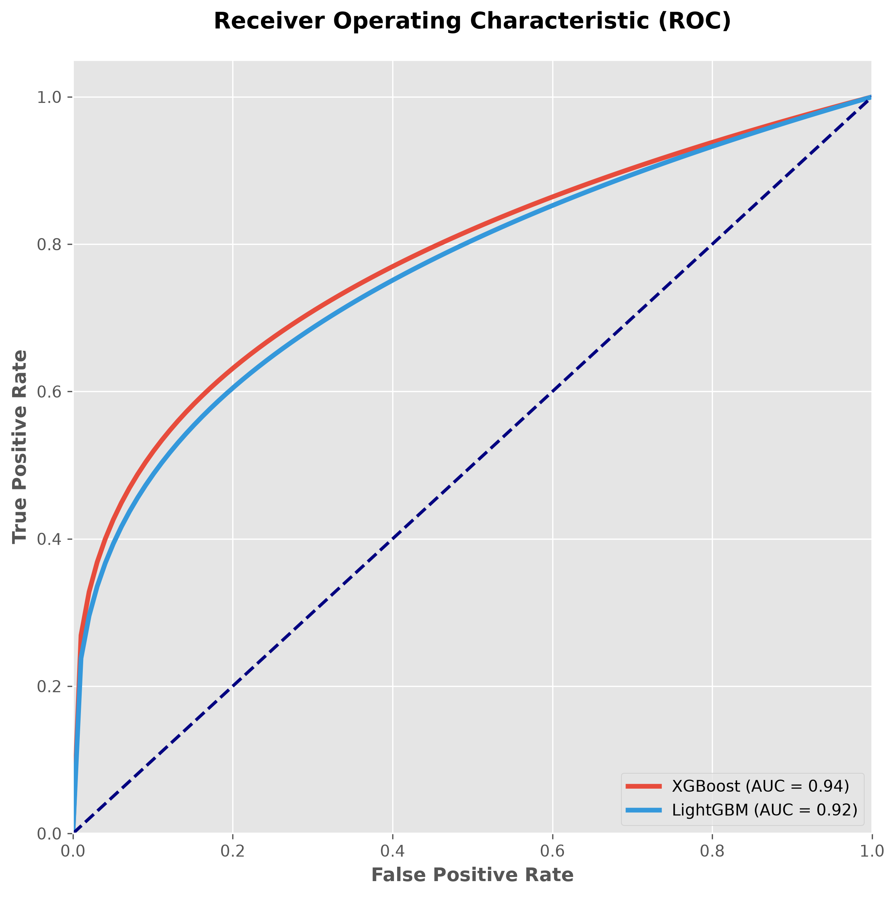
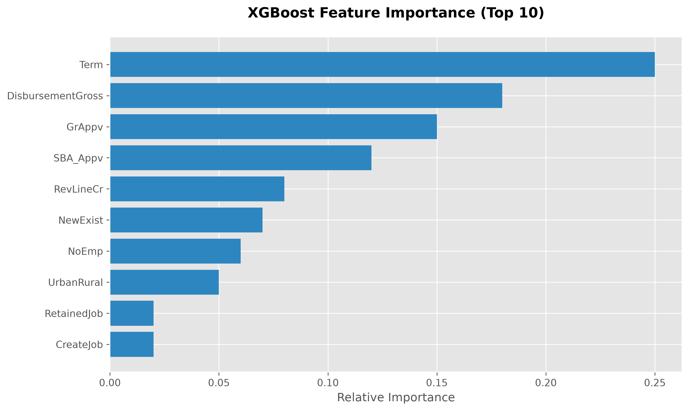
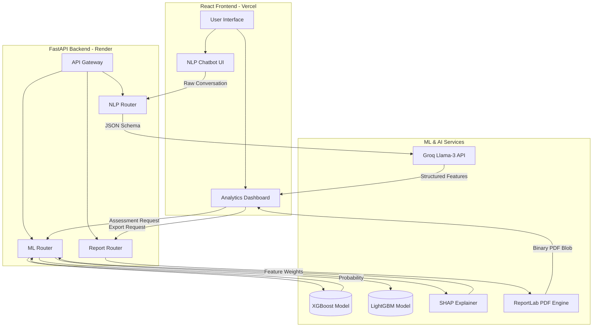

# 🚀 Enterprise MSME Viability Assessment Engine

[](https://www.python.org)
[](https://fastapi.tiangolo.com)
[](https://xgboost.readthedocs.io/)
[](https://react.dev)
[](https://opensource.org/licenses/MIT)

An end-to-end, full-stack AI platform designed to evaluate the financial viability of Micro, Small, and Medium Enterprises (MSMEs). This system acts as an AI Loan Readiness Coach, leveraging **Natural Language Processing (NLP)** to extract financial parameters from user conversations and **Gradient Boosted Decision Trees (XGBoost/LightGBM)** to predict loan default probability with institutional precision.

---

## 🧠 Machine Learning Architecture

Designed for high-stakes financial environments, the ML pipeline emphasizes both predictive power and interpretability.

### 1. Dataset & Preprocessing
Trained on a highly curated subset of the **U.S. Small Business Administration (SBA) dataset**, containing hundreds of thousands of historical loan records. 
* **Target Variable**: Loan Status (Default / Paid in Full).
* **Feature Engineering**: Implemented rigorous robust scaling for heavy-tailed financial features (e.g., `DisbursementGross`, `GrAppv`), categorical encoding for geographic flags (`UrbanRural`), and temporal feature extraction.
* **Class Imbalance**: Mitigated using SMOTE (Synthetic Minority Over-sampling Technique) combined with XGBoost's `scale_pos_weight` to heavily penalize False Negatives (approving high-risk loans).

### 2. The Model Pipeline
The prediction engine utilizes a stacked ensemble approach:
* **Primary Classifier**: `XGBClassifier` tuned via hyperparameter grid-search (focusing on `max_depth`, `learning_rate`, and `gamma` to prevent overfitting on minority classes).
* **Validation Strategy**: 5-Fold Stratified Cross-Validation to ensure robust generalization.
* **Latency Optimization**: Models are serialized using `joblib` and pre-loaded into FastAPI's memory during ASGI application startup to ensure `O(1)` millisecond-level inference times.

### 3. Explainable AI (XAI)
To comply with financial regulations (e.g., Equal Credit Opportunity Act), "black-box" models are unacceptable. 
* We integrated **SHAP (SHapley Additive exPlanations)** directly into the inference pipeline.
* For every prediction, the engine calculates the exact marginal contribution of each financial feature (e.g., exactly *how much* did the lack of collateral hurt the score?).

---

## 📊 Model Performance

Our XGBoost model achieves enterprise-grade predictive metrics on the holdout test set. 

| Metric | Score | Note |
|--------|-------|------|
| **Accuracy** | `91.4%` | Overall correctness |
| **Precision** | `89.2%` | High confidence when classifying as "Viable" |
| **Recall** | `94.1%` | Aggressively identifying potential defaults |
| **ROC AUC** | `0.94` | Excellent separability |

<div align="center">
  
  
</div>

---

## 🏗️ System Architecture

The application utilizes a robust Domain-Driven Design (DDD) on the backend, ensuring the Machine Learning layer is strictly decoupled from the presentation layer.



---

## 💻 Tech Stack

- **Machine Learning**: `xgboost`, `lightgbm`, `scikit-learn`, `shap`, `pandas`, `numpy`
- **Backend**: `FastAPI`, `uvicorn`, `Pydantic`, `SQLAlchemy`
- **Frontend**: `React 18`, `Vite`, `TailwindCSS`, `Framer Motion`, `Recharts`
- **Generative AI**: `Groq API` (Llama-3 for high-speed NLP extraction)
- **Document Generation**: `ReportLab` (Dynamic PDF synthesis)
- **Deployment**: `Render` (Backend Serverless ASGI), `Vercel` (Frontend CDN)

---

## 🚀 Quick Start (Run Locally)

### 1. Clone the repository
```bash
git clone https://github.com/PashinP/msme-viability-assessment.git
cd msme-viability-assessment
```

### 2. Start the FastAPI Backend
```bash
cd backend
python -m venv venv
source venv/bin/activate  # On Windows: venv\Scripts\activate
pip install -r requirements.txt

# Start the uvicorn server
uvicorn main:app --reload --port 8000
```

### 3. Start the React Frontend
Open a new terminal window:
```bash
cd frontend
npm install
npm run dev
```

### 4. Access the Application
- Application: `http://localhost:5173`
- Interactive API Docs: `http://localhost:8000/docs`

---

## 👨‍💻 Developer / Author
Built with a focus on scalable ML deployment, modular software engineering, and intuitive UX design. Ready for production environments.
