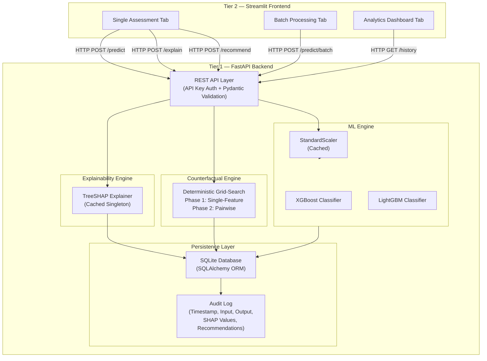
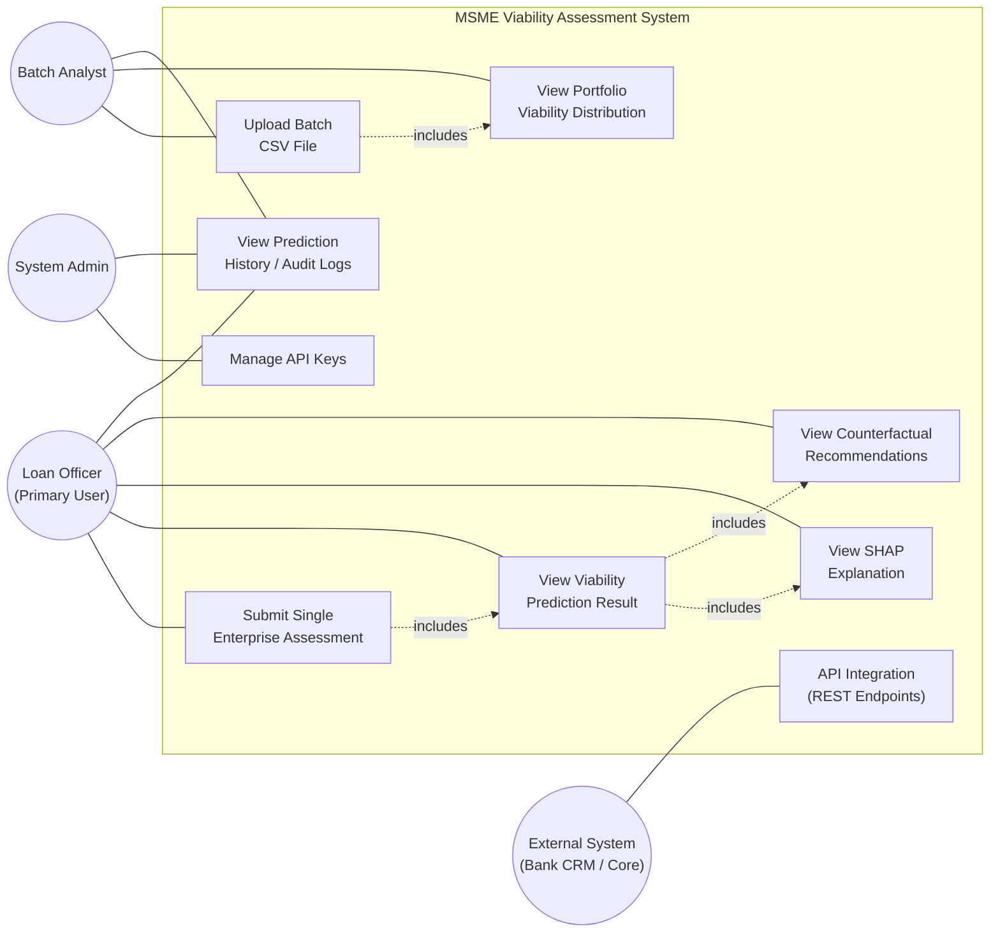
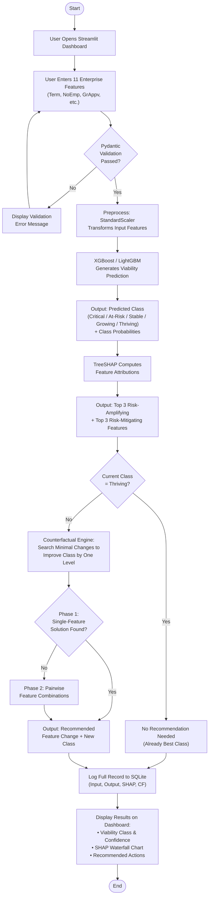
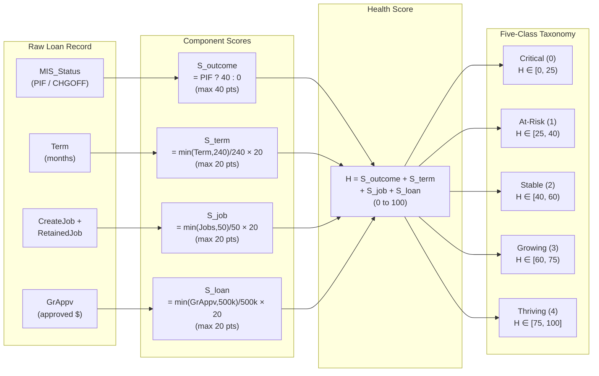
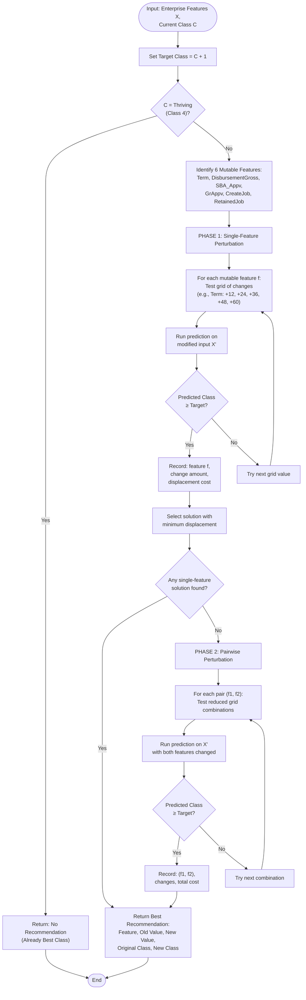
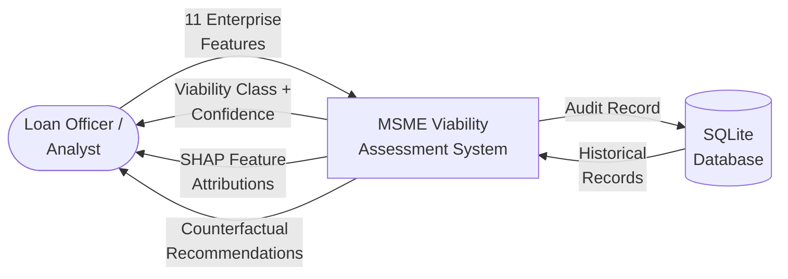

# MSME Viability Assessment — Report Diagrams

All diagrams below are in Mermaid format. Use these to generate proper diagrams for the Word document.

---

## Figure 1: System Architecture Overview

---

## Figure 2: Use Case Diagram

---

## Figure 3: Activity Diagram — Prediction and Recommendation Workflow

---

## Figure 4: Composite Health Score Construction and Five-Class Discretization

---

## Figure 5: Counterfactual Recommendation Algorithm Flowchart

---

## Figure 6: SHAP Global Feature Importance — Bar Chart Data

This is a horizontal bar chart. Use the values below to create the chart in Word:

| Rank | Feature | Mean Absolute SHAP Value |
|:---:|:---|:---:|
| 1 | GrAppv (Gross Approved Amount) | 1.5191 |
| 2 | Term (Loan Duration) | 1.4523 |
| 3 | RetainedJob | 0.6152 |
| 4 | SBA_Appv (SBA Guaranteed Portion) | 0.4927 |
| 5 | CreateJob | 0.3778 |
| 6 | DisbursementGross | 0.1547 |
| 7 | NoEmp (Number of Employees) | 0.0611 |
| 8 | UrbanRural | 0.0471 |
| 9 | RevLineCr (Revolving Line of Credit) | 0.0399 |
| 10 | NewExist (New vs Existing Business) | 0.0219 |
| 11 | LowDoc (Low Documentation Program) | 0.0124 |

**Chart Style:** Horizontal bars, sorted descending. GrAppv and Term bars should be prominently longer than all others. Use a blue/teal color gradient. Title: "Global SHAP Feature Importance (Mean |SHAP| on 1,000 Samples)".

---

## Figure 7: Streamlit Dashboard — Single Assessment Output (Description)

The Streamlit dashboard has three tabs at the top: **Single Assessment | Batch Processing | Analytics**

**Single Assessment Tab Layout:**

**Left Column (Input Panel):**
- Header: "Enterprise Features"
- 11 input fields with sliders/number inputs:
  - Term (months): slider 0–480
  - Number of Employees: number input
  - New or Existing Business: dropdown (1=Existing, 2=New)
  - CreateJob: number input
  - RetainedJob: number input
  - Urban/Rural: dropdown (0=Undefined, 1=Urban, 2=Rural)
  - Revolving Line of Credit: toggle (Yes/No)
  - Low Documentation: toggle (Yes/No)
  - Disbursement Gross: currency input
  - SBA Approved: currency input
  - Gross Approved: currency input
- Green "Assess Viability" button at bottom

**Right Column (Results Panel):**
- **Prediction Card:** Large colored badge showing class (e.g., "GROWING" in green), with confidence percentage (e.g., "94.2%")
- **Class Probabilities:** Horizontal stacked bar showing probabilities for all 5 classes
- **SHAP Explanation Section:**
  - Heading: "Why this prediction?"
  - Waterfall chart showing top features pushing prediction up/down
  - Two lists: "Risk Amplifying Factors" (red) and "Risk Mitigating Factors" (green)
- **Recommendations Section:**
  - Heading: "How to improve?"
  - Card showing: "Increase Term from 84 to 144 months → Class improves from Stable to Growing"
  - Arrow icon showing the transition

---

## Additional: Data Flow Diagram (DFD Level 0)

---

## Additional: Class Distribution Pie Chart Data

Use these values to create a pie chart titled "Five-Class Viability Distribution (Full Dataset)":

| Class | Percentage | Color Suggestion |
|:---|:---:|:---|
| Critical (Class 0) | 16.21% | Red |
| At-Risk (Class 1) | 1.23% | Orange |
| Stable (Class 2) | 53.31% | Blue |
| Growing (Class 3) | 17.42% | Green |
| Thriving (Class 4) | 11.83% | Dark Green |

---

## Additional: Confusion Matrix Heatmap Data (XGBoost)

Use this 5×5 matrix to create a heatmap. Rows = Actual, Columns = Predicted.

|  | Pred: Critical | Pred: At-Risk | Pred: Stable | Pred: Growing | Pred: Thriving |
|:---|:---:|:---:|:---:|:---:|:---:|
| **Actual: Critical** | 23,127 | 876 | 4,906 | 0 | 0 |
| **Actual: At-Risk** | 549 | 879 | 769 | 0 | 0 |
| **Actual: Stable** | 3,893 | 520 | 90,345 | 342 | 0 |
| **Actual: Growing** | 0 | 0 | 623 | 29,187 | 1,260 |
| **Actual: Thriving** | 0 | 0 | 0 | 211 | 20,898 |

**Note:** The matrix shows that most errors occur at class boundaries: Critical↔Stable and At-Risk↔Critical/Stable. Growing and Thriving are very cleanly separated.
